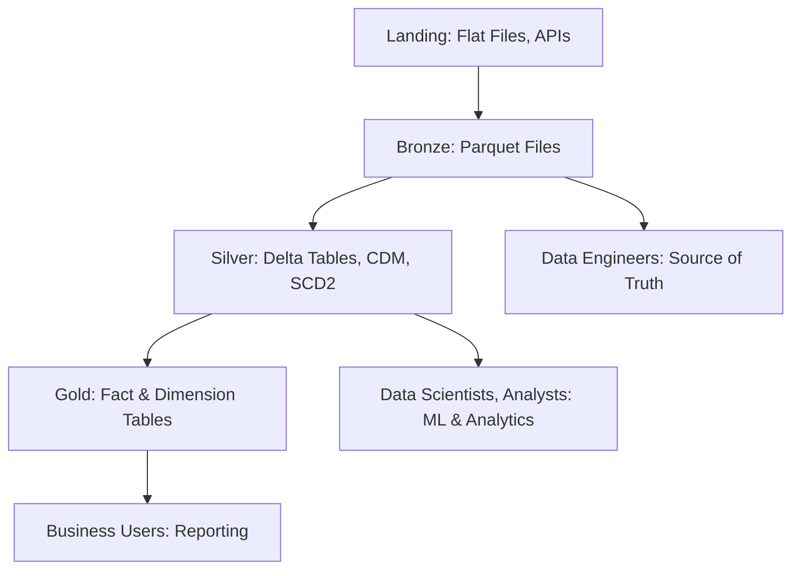
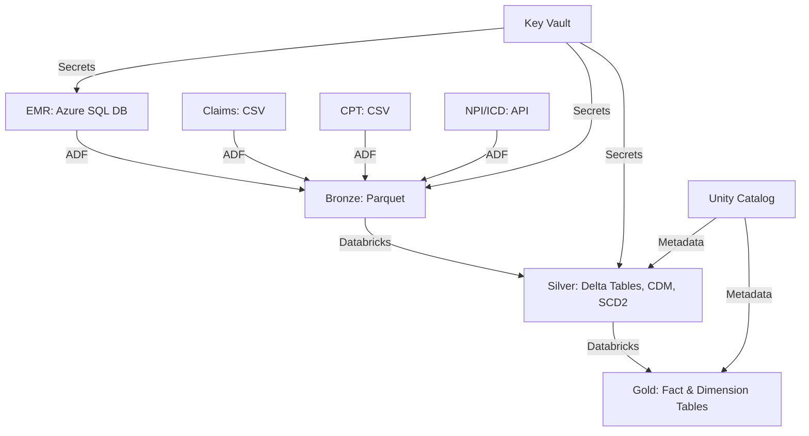

 

# Healthcare Revenue Cycle Management (RCM) Data Engineering Project on Azure

This document outlines an end-to-end data engineering project for Healthcare Revenue Cycle Management (RCM) using the Azure Data Engineering stack. It covers the architecture, data sources, pipelines, transformations, and best practices for building a robust data pipeline to support RCM reporting and analytics.

---

## Overview of RCM

Revenue Cycle Management (RCM) is the financial process used by hospitals to manage the administrative and clinical functions associated with patient care, from appointment scheduling to final payment collection. The goal is to ensure the hospital remains financially healthy while providing quality care.

### Simplified RCM Process

1. **Patient Visit**:
    - Collect patient and insurance details to determine payment responsibility (e.g., insurance covers $15,000, patient covers $5,000 of a $20,000 bill).
2. **Service Delivery**:
    - Medical services are provided to the patient.
3. **Billing**:
    - The hospital generates a bill based on services provided.
4. **Claims Review**:
    - Insurance companies review claims, which may be fully paid, partially paid, or declined.
5. **Payments and Follow-ups**:
    - Follow up with insurance or patients for outstanding payments.
6. **Tracking and Improvement**:
    - Monitor Key Performance Indicators (KPIs) to optimize financial processes.

### Key Aspects of RCM

- **Accounts Receivable (AR)**:
    
    - Focuses on collecting payments from patients and insurers.
    - Objectives:
        - Maximize cash collection.
        - Minimize collection period (e.g., 93% collectible at 30 days, 85% at 60 days, 73% at 90 days).
    - KPIs:
        - **AR > 90 Days**: Percentage of AR older than 90 days (e.g., $200K / $1M = 20%).
        - **Days in AR**: Average days to collect AR (e.g., $1M in 100 days = $10K/day; $400K AR = 40 days).
- **Accounts Payable**:
    
    - Manages payments owed by the hospital to vendors or suppliers.

### Patient Payment Risks

Patients are more likely to bear payment responsibility in scenarios like:

- Low insurance coverage.
- Private clinics or dental treatments.
- High deductibles.

---

## Data Engineering Objectives

The data engineering pipeline aims to:

- Ingest data from multiple sources (EMR, Claims, APIs).
- Transform and store data in a structured format (fact and dimension tables).
- Enable reporting teams to generate KPIs for AR optimization.

---

## Data Sources

The pipeline processes data from the following sources:

1. **Electronic Medical Records (EMR)**:
    
    - Source: Azure SQL Database.
    - Tables:
        - Patients
        - Providers
        - Departments
        - Transactions
        - Encounters
    - Databases: `trendytech-hospital-a`, `trendytech-hospital-b` (e.g., Manipal Hospital, Columbia Asia).
2. **Claims Data**:
    
    - Source: Flat files (CSV) delivered monthly to ADLS Gen2 landing zone.
    - Represents insurance company data.
3. **National Provider Identifier (NPI) Data**:
    
    - Source: Public API.
    - Provides unique identifiers for healthcare providers.
4. **ICD and CPT Codes**:
    
    - **ICD Codes**: Standardized diagnosis codes (via API).
    - **CPT Codes**: Procedure codes (flat files in landing zone).
    - Difference: ICD codes describe diagnoses, while CPT codes describe procedures ([Reference](https://www.simplepractice.com/blog/icd-codes-and-cpt-codes/)).

---

## Solution Architecture

The pipeline follows the **Medallion Architecture** with the following layers:

- **Landing**: Raw data ingestion (flat files, APIs).
- **Bronze**: Source-of-truth data stored in Parquet format.
- **Silver**: Cleaned, enriched, and conformed data (Common Data Model, SCD Type 2, Delta tables).
- **Gold**: Aggregated data in fact and dimension tables for reporting (Delta tables).

### Data Flow



### Azure Services Used

- **Azure Data Factory (ADF)**: Orchestrates data ingestion and pipeline execution.
- **Azure Databricks**: Handles data processing and transformations.
- **Azure SQL Database**: Stores EMR data.
- **Azure Data Lake Storage (ADLS) Gen2**: Stores raw, bronze, silver, and gold data.
- **Azure Key Vault**: Secures credentials and secrets.
- **Azure Databricks Unity Catalog**: Manages metadata (replacing Hive metastore).

---

## Storage Structure

ADLS Gen2 account: `ttadlsdev`

- **Containers/Folders**:
    - `landing/`: Raw flat files (e.g., Claims, CPT).
    - `bronze/`: Parquet files (source of truth).
    - `silver/`: Delta tables (cleaned, enriched, SCD2).
    - `gold/`: Delta tables (fact and dimension tables).
    - `configs/`: Metadata-driven pipeline configuration (e.g., `emr/load_config.csv`).

### Configuration File (`configs/emr/load_config.csv`)

```csv
database,datasource,tablename,loadtype,watermark,is_active,targetpath
trendytech-hospital-a,hos-a,dbo.encounters,Incremental,ModifiedDate,0,hosa
trendytech-hospital-a,hos-a,dbo.patients,Incremental,ModifiedDate,0,hosa
trendytech-hospital-a,hos-a,dbo.transactions,Incremental,ModifiedDate,0,hosa
trendytech-hospital-a,hos-a,dbo.providers,Full,,0,hosa
trendytech-hospital-a,hos-a,dbo.departments,Full,,0,hosa
trendytech-hospital-b,hos-b,dbo.encounters,Incremental,ModifiedDate,0,hosb
trendytech-hospital-b,hos-b,dbo.patients,Incremental,Updated_Date,1,hosb
trendytech-hospital-b,hos-b,dbo.transactions,Incremental,ModifiedDate,0,hosb
trendytech-hospital-b,hos-b,dbo.providers,Full,,0,hosb
trendytech-hospital-b,hos-b,dbo.departments,Full,,0,hosb
```

---

## Pipeline Design (Part 1)

### Linked Services

1. **Azure SQL DB**: Connects to EMR databases.
2. **ADLS Gen2**: Accesses landing, bronze, silver, and gold folders.
3. **Delta Lake**: Connects to Databricks Delta tables.
4. **Key Vault**: Stores credentials securely.

### Datasets

1. **Azure SQL DB**:
    - Parameters: Database name, schema name, table name.
2. **Delimited Text**:
    - Path: `configs/emr/load_config.csv`.
3. **Parquet**:
    - Bronze layer output files.
4. **Databricks Delta Lake**:
    - Schema and table names for audit and silver/gold layers.

### Audit Table

Stores metadata about data loads in a Delta table.

```sql
CREATE SCHEMA IF NOT EXISTS audit;

CREATE TABLE IF NOT EXISTS audit.load_logs (
    id BIGINT GENERATED ALWAYS AS IDENTITY,
    data_source STRING,
    tablename STRING,
    numberofrowscopied INT,
    watermarkcolumnname STRING,
    loaddate TIMESTAMP
);
```

### ADF Pipeline Activities

1. **Lookup Activity**:
    - Reads `configs/emr/load_config.csv` to iterate over entities (e.g., encounters, patients).
2. **ForEach Activity**:
    - Iterates over each config entry (10 tables).
    - Checks if the target Parquet file exists in `bronze/<targetpath>/<tablename>.parquet`.
    - If exists, moves it to `bronze/<targetpath>/archive/<year>/<month>/<day>/<tablename>.parquet`.
3. **Copy Activity**:
    - **Full Load**:
        - Query: `SELECT * FROM <tablename>`.
        - Writes to `bronze/<targetpath>/<tablename>.parquet`.
        - Logs to audit table:
            
            ```sql
            INSERT INTO audit.load_logs(data_source, tablename, numberofrowscopied, watermarkcolumnname, loaddate)
            VALUES ('<datasource>', '<tablename>', <rowscopied>, '<watermark>', utcNow())
            ```
            
    - **Incremental Load**:
        - Checks `audit.load_logs` for the last load date:
            
            ```sql
            SELECT COALESCE(CAST(MAX(loaddate) AS DATE), '1900-01-01') AS last_fetched_date
            FROM audit.load_logs
            WHERE data_source = '<datasource>' AND tablename = '<tablename>'
            ```
            
        - Queries source with watermark:
            
            ```sql
            SELECT *, '<datasource>' AS datasource
            FROM <tablename>
            WHERE <watermark> >= '<last_fetched_date>'
            ```
            
        - Writes to `bronze/<targetpath>/<tablename>.parquet`.
        - Logs to audit table (same as full load).

### Pipeline Execution

- **Sequential vs. Parallel**:
    - Initially sequential for stability.
    - Optimized to parallel for performance (Part 2).

---

## Pipeline Design (Part 2)

### Bronze Layer Enhancements

1. **Claims and CPT Data**:
    - Ingested from `landing/` (CSV) to `bronze/` (Parquet).
2. **NPI and ICD Codes**:
    - Fetched via API and written directly to `bronze/` (Parquet).
3. **Note**:
    - NPI codes in the dataset may not start with '1' (data discrepancy).
    - API data may result in nulls during joins due to limited records.

### Silver Layer

- **Transformations**:
    - **Cleaning**: Remove invalid or incomplete records (e.g., `is_quarantined` flag).
    - **Common Data Model (CDM)**: Standardize schema across sources.
    - **SCD Type 2 (SCD2)**: Track historical changes with `inserted_date`, `modified_date`, and `is_current` columns.
        - Example for Patients:
            
            ```sql
            -- Existing record
            patient_key: 101, name: Sumit, address: Hyderabad (Himayat Nagar)
            inserted_date: 2022-11-11, modified_date: 2022-11-11, is_current: true
            
            -- Update
            patient_key: 101, name: Sumit, address: Hyderabad (Tarnaka)
            inserted_date: 2024-01-01, modified_date: 2024-01-01, is_current: true
            -- Previous record updated
            modified_date: 2024-01-01, is_current: false
            ```
            
- **Tables**:
    - **SCD2**: Patients, Transactions, Encounters, Claims, CPT, NPI, ICD.
    - **Full Load**: Providers, Departments.
- **Output**: Delta tables in `silver/`.

### Gold Layer

- **Filters**:
    - `is_current = true`
    - `is_quarantined = false`
- **Structure**:
    - **Fact Tables**: Numeric metrics (e.g., transaction amounts, claim amounts).
    - **Dimension Tables**: Supporting entities (e.g., Patients, Providers, Departments).
- **Output**: Delta tables in `gold/` for reporting.

### Best Practices and Enhancements

1. **Azure Key Vault**:
    
    - Created: `tt-health-care-kv`.
    - Secrets stored for Azure SQL DB, ADLS Gen2, and Databricks.
    - Access policy configured via Azure App Registration for ADF and Databricks.
    - Databricks secret scope: `https://adb-2871789655161196.16.azuredatabricks.net#secrets/createScope`.
    - Example: `dbutils.secrets.get('tt-hc-kv', 'tt-adls-access-key-dev')`.
2. **Improved Naming Conventions**:
    
    - Standardized folder paths: `bronze/<targetpath>/<tablename>.parquet`.
    - Archive structure: `bronze/<targetpath>/archive/<year>/<month>/<day>/<tablename>.parquet`.
3. **Parallel Pipeline Execution**:
    
    - Updated ForEach activity to run in parallel for faster processing.
4. **Active/Inactive Flag**:
    
    - `is_active` in `load_config.csv` enables/disables table processing.
5. **Unity Catalog**:
    
    - Replaced Hive metastore with Unity Catalog.
    - Structure: `catalog_name.schema_name.table_name`.
6. **Retries**:
    
    - Added retry logic to ADF activities for robustness (e.g., API failures).

---

## Data Flow Diagram



---

## Notes and Considerations

- **Data Quality**:
    - All data is generated using the Faker module, which may introduce discrepancies.
    - Joins (e.g., NPI, ICD) may result in nulls due to limited API data.
- **SCD2 Implementation**:
    - Ensures historical tracking for slowly changing dimensions (e.g., patient address changes).
- **Gold Layer**:
    - Optimized for reporting KPIs like AR > 90 days and Days in AR.
- **Future Improvements**:
    - Enhance error handling and logging.
    - Implement data validation checks before moving to silver/gold layers.

---

## GitHub Integration

- Store pipeline configurations, scripts, and notebooks in a GitHub repository.
- Credentials:
    - Username and personal access token stored in Key Vault.
- Use GitHub for version control and collaboration.

---

This architecture provides a scalable, secure, and efficient pipeline for RCM data processing, enabling hospitals to optimize their financial operations through actionable insights.